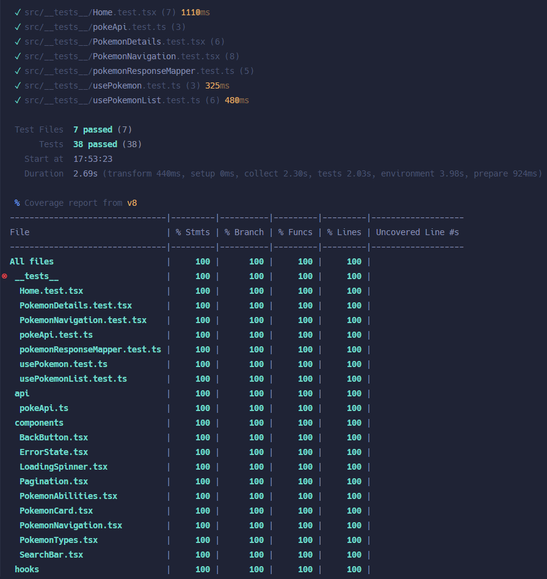

# Pokédex - Muta Prueba Técnica

Una aplicación React que muestra una lista de Pokémon utilizando la PokeAPI, permitiendo a los usuarios buscar y ver información detallada sobre cada Pokémon.

## Características

- Mostrar una lista paginada de Pokémon
- Buscar Pokémon por nombre
- Ver información detallada sobre cada Pokémon
- Diseño responsivo para móviles y escritorio
- Soporte para el idioma español
- Manejo de errores y estados de carga
- Navegación entre Pokémon utilizando las teclas de flecha izquierda y derecha

## Tecnologías utilizadas

- React
- TypeScript
- Tailwind CSS
- Axios para las solicitudes a la API
- ESLint y Prettier para el linting y formateo del código
- Vitest para las pruebas
- React Router DOM para la navegación
- Yarn como manejador de paquetes
- Vite como empaquetador

## Estructura del proyecto

- `/src/api` - Integración con la PokeAPI
- `/src/components` - Componentes React
- `/src/hooks` - Custom React hooks para la obtención de datos y el manejo de estados
- `/src/interfaces` - TypeScript interfaces
- `/src/pages` - Componentes de página (Home y PokemonDetails)
- `/src/utils` - Funciones y constantes utilitarias
- `/src/router` - Configuración de rutas

## Pruebas

El proyecto incluye una cobertura de pruebas completa para:

- Renderizado de componentes
- Integración con la API
- Manejo de errores
- Funcionalidad de búsqueda
- Paginación
- Navegación entre Pokémon

## Manejo de errores

La aplicación implementa el manejo de errores para:

- Solicitudes a la API fallidas
- IDs de Pokémon inválidos
- Búsqueda sin resultados

## Integración con la API

Utiliza la PokeAPI (https://pokeapi.co/api/v2) para obtener:

- Lista paginada de Pokémon
- Detalles individuales de Pokémon
- Habilidades y tipos de Pokémon
